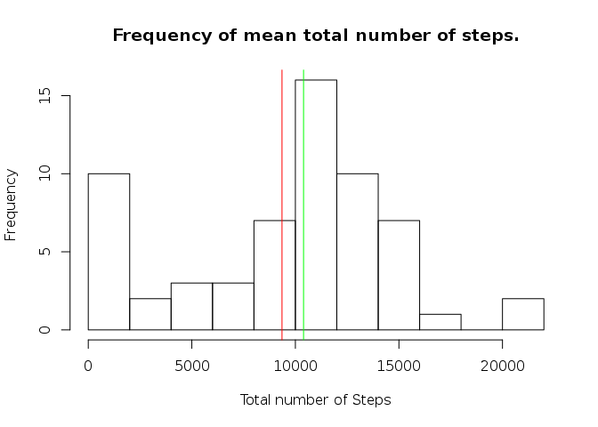
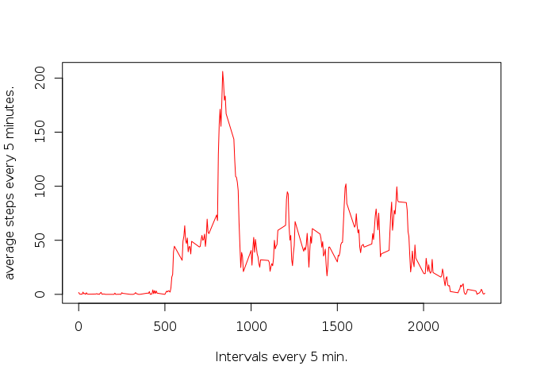
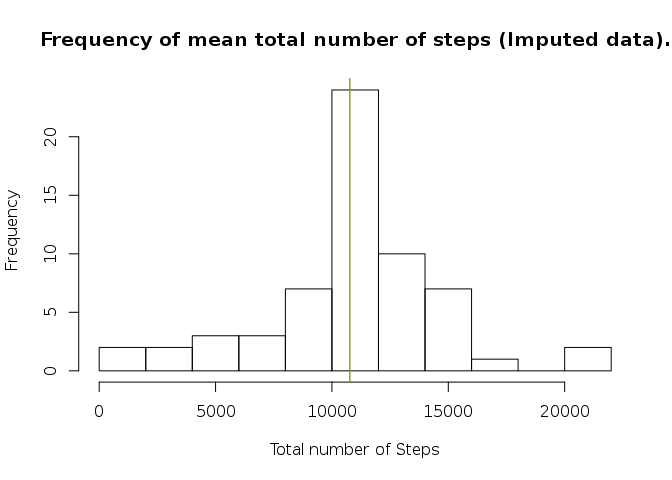
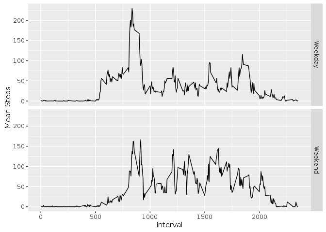

# Reproducible Research: Peer Assessment 1


## Loading and preprocessing the data

First I set the environment and the libraries, also before loading the data I had to unzip the file with the command *unzip activity.zip*. 


```r
setwd("~/RepData_PeerAssessment1")
library("reshape2", lib.loc="~/R/x86_64-pc-linux-gnu-library/3.1")
library("ggplot2", lib.loc="~/R/x86_64-pc-linux-gnu-library/3.1")
```

Then  I actually loaded the file and formated the column *date*.

```r
activity <- read.csv("~/RepData_PeerAssessment1/activity.csv", row.names=NULL)
activity$date <- as.Date(activity$date, format = "%Y-%m-%d")
```


## What is mean total number of steps taken per day?

To show the mean total number of steps taken per day I'll calculate it using tapply, and then plotting an histogram showing with a vertical red line the mean, and with a vertical green line a median.


```r
nsteps_total <- tapply(activity$steps, activity$date, sum, na.rm=TRUE)
hist(nsteps_total, breaks = 10, main="Frequency of mean total number of steps.", xlab="Total number of Steps", ylab = "Frequency")
abline(v=mean(nsteps_total), col="red")
abline(v=median(nsteps_total), col="green")
```

<!-- -->

It's posible to see that the mean is 9354.2295082 and the median is 10395

## What is the average daily activity pattern?

The next plot shows the average daily activity pattern


```r
nsteps_every5min <- tapply(activity$steps
                           , activity$interval, mean, na.rm=TRUE)
plot(x=dimnames(nsteps_every5min)[[1]] 
     , y=nsteps_every5min, type="l", col="red"
     , xlab = "Intervals every 5 min.", ylab = "average steps every 5 minutes.")
```

<!-- -->

```r
which.max(nsteps_every5min)
```

```
## 835 
## 104
```

```r
nsteps_every5min[which.max(nsteps_every5min)]
```

```
##      835 
## 206.1698
```

Where the maximum average daily activity is 206.1698113


## Imputing missing values

The total number of rows with a missing number is 2304. To impute the missing row:
1. I select the missing rows, 
2. then I create a new data set, so later I can compare the original with the imputed one,
3. and finally I actually impute the value with the mean of that interval.


```r
table(complete.cases(activity))
```

```
## 
## FALSE  TRUE 
##  2304 15264
```

```r
interval_to_impute <- unique(activity[!complete.cases(activity),"interval"])

activity_2 <- activity

for(i in interval_to_impute){
    imp_value <- nsteps_every5min[unlist(dimnames(nsteps_every5min))==i]
    activity_2[!complete.cases(activity_2) 
             & activity_2$interval==i,"steps"] <- imp_value
}

nsteps_total_2 <- tapply(activity_2$steps, activity_2$date, sum, na.rm=TRUE)
hist(nsteps_total_2, breaks = 10, main="Frequency of mean total number of steps (Imputed data).", xlab="Total number of Steps", ylab = "Frequency")
mean(nsteps_total_2)
```

```
## [1] 10766.19
```

```r
abline(v=mean(nsteps_total_2), col="red")
median(nsteps_total_2)
```

```
## [1] 10766.19
```

```r
abline(v=median(nsteps_total_2), col="green")
```

<!-- -->

It's interesting to observed with the imputed data set that the mean (1.0766189\times 10^{4}) and the median (1.0766189\times 10^{4}) are equal, not as the original data where the mean (9354.2295082) and the median (10395) were different.


## Are there differences in activity patterns between weekdays and weekends?


```r
activity_2$day <- weekdays(activity_2$date)

weekday <- activity_2$day %in% c("Monday", "Tuesday"
                                , "Wednesday", "Thursday", "Friday")
weekend <- activity_2$day %in% c("Saturday", "Sunday")

activity_2[weekday, "weekday"] <- "Weekday" 
activity_2[weekend, "weekday"] <- "Weekend" 

activity_2$weekday <- as.factor(activity_2$weekday)

steps_2levels<- with(activity_2
                     , tapply(steps, list(interval, weekday), mean))
steps_2levels <- as.data.frame(steps_2levels)
steps_2levels$interval <- as.integer(rownames(steps_2levels))

reshaped_steps_2levels <- reshape(as.data.frame(steps_2levels), 
                                  varying = c("Weekday", "Weekend"),
                                  v.names = "Mean_Steps",
                                  timevar = "day_type",
                                  times = c("Weekday", "Weekend"),
                                  direction = "long")

qplot(x=interval, y=Mean_Steps, data = reshaped_steps_2levels
      , geom=c("path"), facets= day_type~., ylab = "Mean Steps")
```

<!-- -->

At the plot is possible to see that the variance of the mean steps along the weekdays is larger than on weekends. Also the maximum peak is during the weekdays.
